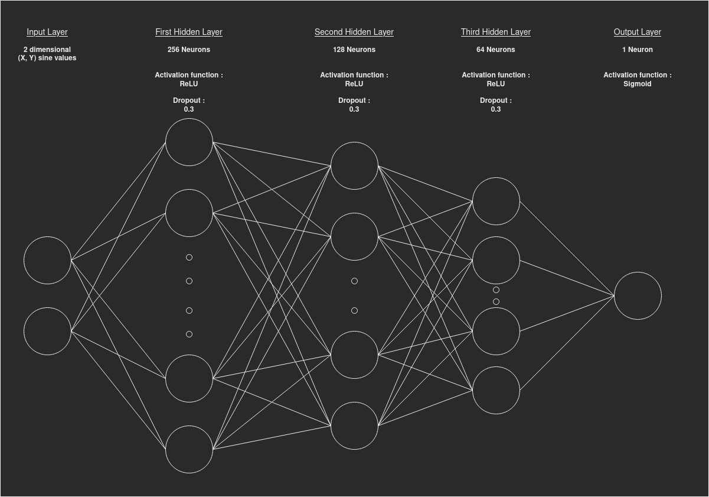
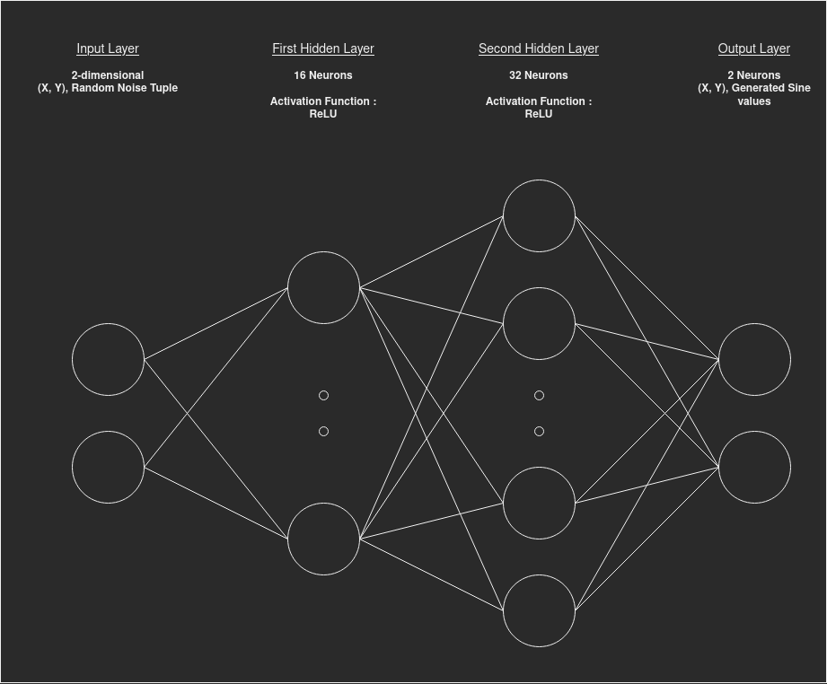

# GANgster

A Generative Adversarial Network to create mugshots

## A) What is a GAN

A Generative Adversarial Network is a model of machine learning used to generate fake data from a dataset. It can be used in various fields, such as creating images of people who don't exist see [thispersondoesnotexist.com](https://thispersondoesnotexist.com/)

### 1) How to build one

There are two main parts in a GAN :

- The discriminator :

The discriminator networks are the most used neural networks in the field of Artificial Intelligence. Those are networks that are trained to recognise some type of data and extract an information out of them. For example, an IA that will classify plants is most likely built with a discriminator network.

- The generator :

This is the most important part of the GAN. It will create data from a random noise, and will be trained against the discriminator in order to build more realistic data over time.

### 2) How to train one

The way GANs work (most of the time at least) is the following: The _Generator_ is given an array of noise, and processes this array to spit out an array of imformation that it thinks is a valid representation of true data. The _discriminator_ is then fed this data and tries to figure out whether it is true data or false data. The _discriminator_ may be fed data from the dataset as well as data from the _Generator_. The idea behind is to make both the networks compete against each other to get better and better at generating or recognizing fake data.

During the training, the output of the discriminator will go through an loss function, and the result will be used to update both the _discriminator_ neurons and the _generator_ neurons. The _generator_ will therefore be trained to replicate data similar to the dataset, in order to fool the _discriminator_. The diagrams of the first draft may help understanding how the networks work together.

### 3) How to use one

Once the generator is trained, it is easy to gather the data it produces, and tranform them into useful data. In our first draft, the data will simply be used as x, y coordinates, and should (If the GAN has been correctly trained) resemble a sine wave. In our second case, the output will be used as gray values for a pixel.

## B) First draft: Generate Sine wave values

### 1) The discriminator :

### 2) The generator :

## C) GANgster

### 1) The discriminator :

### 2) The generator :

## D) Installation + training
